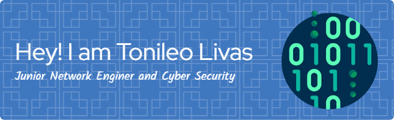

<h1 align="center">Hi 👋, I'm Tonileo Livas</h1>

###

  

## <h3 align="center">A passionate Networking Enginer and Cyber security from Timor-Leste</h3>
## <h3 align="center">Skills</h3>

 

 

<h3 align="center">esperience in platform:</h3>
 
 

  
<h3 align="left">Languages and Tools:</h3>

        

  

## My Github start

###
